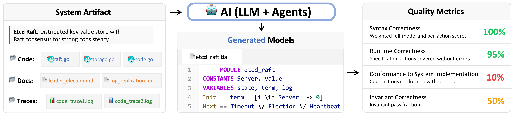
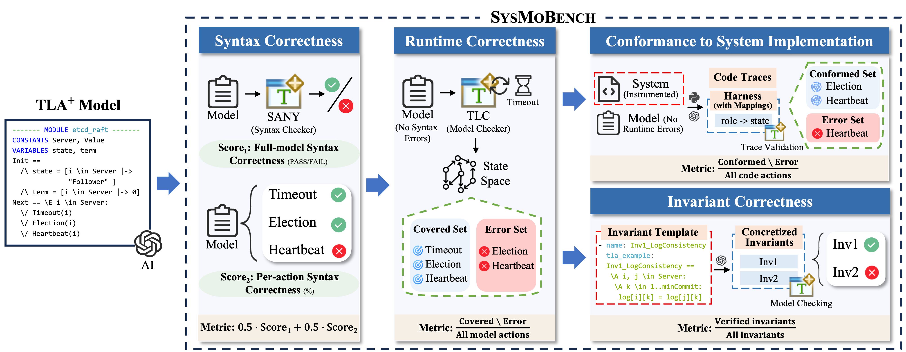

# SysMoBench: Evaluating AI on Formally Modeling Complex Real-World Systems

## Overview

Formal models are essential to specifying large, complex computer systems and verifying their correctness, but are notoriously expensive to write and maintain. Recent advances in generative AI show promise in generating certain forms of specifications. However, existing work mostly targets small code, not complete systems. It is unclear whether AI can deal with realistic system artifacts, as this requires abstracting their complex behavioral properties into formal models.

SysMoBench presents a benchmark that evaluates AI's ability to formally model large, complex systems. We focus on concurrent and distributed systems, which are keystones of today's critical computing infrastructures, encompassing operating systems and cloud infrastructure. We use TLA+, the de facto specification language for concurrent and distributed systems, though the benchmark can be extended to other specification languages.

We address the primary challenge of evaluating AI-generated models by automating metrics like syntactic and runtime correctness, conformance to system code, and invariant correctness. SysMoBench currently includes nine diverse system artifacts: the Raft implementation of Etcd and Redis, the Spinlock and Mutex in Asterinas OS, etc.; more artifacts are being actively added.

SysMoBench sources its tasks from real-world systems and automatically evaluates AI-generated TLA+ models with different metrics,
   as illustrated in the following figure.



## Key Features

- **Automated Quality Metrics**: Four automated phases evaluate AI-generated models from multiple dimensions: syntax correctness, runtime correctness, conformance to system implementation, and invariant correctness.

- **Real-World System Artifacts**: Nine diverse widely used systems, including distributed consensus systems (Etcd Raft, Redis Raft), concurrent synchronization systems (Asterinas Spinlock/Mutex/Rwmutex), distributed replication systems (Xline CURP), and PGo-compiled systems.

- **Extensible Framework**: Adding new system artifacts requires no reference model—only system code, instrumentation for trace collection, and invariant templates, making the benchmark easy to extend with additional systems.

## Installation

### Prerequisites

- Python 3.8+
- Java 11+ (for TLA+ tools)

### Setup

1. Navigate to the project directory and install:

```bash
cd LLM_Gen_TLA_benchmark_framework
pip install -e .
```

2. Download TLA+ tools:

```bash
sysmobench-setup
```

3. Configure API keys:

```bash
export OPENAI_API_KEY="your-key"
export ANTHROPIC_API_KEY="your-key"
export GEMINI_API_KEY="your-key"
export DEEPSEEK_API_KEY="your-key"
```

4. Verify installation:

```bash
sysmobench --list-tasks
```


## Quick Start

### Running Your First Evaluation

**General usage:**
```bash
sysmobench --task <task> --method <method> --model <model> --metric <metric>
```

This example demonstrates how to evaluate an AI-generated TLA+ model for the Asterinas Spinlock system using compilation_check metric.

```bash
sysmobench --task spin --method direct_call --model claude --metric compilation_check
```

**Expected Output:**

```
[INFO] Starting benchmark evaluation for task: spin
[INFO] Using method: direct_call, model: claude
[INFO] Generating TLA+ specification...
[INFO] Running syntax correctness evaluation with SANY...

Syntax Evaluation Results: ✓ PASS
Generation time: 12.34s
Compilation time: 0.52s
Syntax errors: 0
Semantic errors: 0
Compilation success rate: PASS (100.0%)

Results saved to: output/spin/direct_call/claude/
```

For detailed usage instructions, see [Usage Guide](docs/Usage.md).

## Benchmark Tasks

SysMoBench includes 9 diverse real-world system artifacts from concurrent and distributed systems:

| System | Type | Description | Source Lang. | Source LoC | TLA+ LoC |
|--------|------|-------------|--------------|------------|----------|
| Asterinas Spinlock | Concurrent | Synchronization | Rust | 213 | 151 |
| Asterinas Mutex | Concurrent | Synchronization | Rust | 186 | 219 |
| Asterinas Rwmutex | Concurrent | Synchronization | Rust | 395 | 250 |
| Etcd Raft | Distributed | Consensus (Raft) | Go | 2,159 | 385 |
| Redis Raft | Distributed | Consensus (Raft) | C | 2,394 | 349 |
| Xline CURP | Distributed | Replication (CURP) | Rust | 4,064 | 100 |
| PGo dqueue | Distributed | Distributed Queue | Go | 175 | 75 |
| PGo locksvc | Distributed | Lock Server | Go | 281 | 93 |
| PGo raftkvs | Distributed | Consensus (Raft) | Go | 3,163 | 508 |

To list all available tasks:

```bash
sysmobench --list-tasks
```

## Evaluation Metrics

SysMoBench provides four automated phases to evaluate AI-generated TLA+ models with different metrics:
   syntax correctness, runtime correctness, conformance to system implementation, and invariant correctness.



### Reproducing Paper Results

The paper uses the following metrics for evaluation:

1. **Syntax Correctness**: Weighted combination (50% each) of `compilation_check` and `action_decomposition`
2. **Runtime Correctness**: `runtime_coverage`
3. **Conformance to System Implementation**:
   - Non-PGo systems (spin, mutex, rwmutex, etcd, redis, xline): `trace_validation`
   - PGo systems (raftkvs, locksvc, dqueue): `pgo_trace_validation`
4. **Invariant Correctness**: `invariant_verification`

### 1. Syntax Correctness

Validates that the generated TLA+ model adheres to TLA+ grammar rules, correct operator usage, and proper module structure using the SANY Syntactic Analyzer. The evaluation includes both full-model compilation and per-action analysis to provide fine-grained feedback on syntax errors.

**Available metrics:**
- `compilation_check` - Basic TLA+ compilation checking using SANY parser
- `action_decomposition` - Evaluate individual actions separately for better granularity

### 2. Runtime Correctness

Evaluates whether the syntactically correct model can execute without runtime errors. The TLC Model Checker performs bounded model checking and simulation to explore the state space without invariant checking, recording covered actions and any runtime errors encountered (e.g., type mismatches, invalid operations).

**Available metrics:**
- `runtime_check` - Model checking with TLC
- `coverage` - TLA+ specification coverage analysis using TLC coverage statistics
- `runtime_coverage` - Runtime coverage using simulation mode to identify successful vs error-prone actions

### 3. Conformance to System Implementation

Measures whether the model conforms to actual system behavior through trace validation. Execution traces collected from instrumented system code are validated against the model to verify if each trace corresponds to a valid path in the model's state space, ensuring behavioral consistency between model and implementation.

**Available metrics:**
- `trace_validation` - Full trace generation and validation pipeline
- `pgo_trace_validation` - Full trace generation and validation pipeline (PGo version)

### 4. Invariant Correctness

Verifies that the model satisfies system-specific safety and liveness properties. Using expert-written invariant templates that are automatically concretized for the generated model, TLC model checking validates correctness properties such as mutual exclusion, log consistency, and progress guarantees across the explored state space.

**Available metrics:**
- `invariant_verification` - Model checking with invariants

## Adding New Systems

SysMoBench is designed to be extensible. To add a new system artifact:

1. **Prepare system artifact**: Collect repository links, branch names, and any relevant materials
2. **Create task definition**: Specify modeling requirements, task configuration and related files in `task.yaml` and define invariant templates for correctness properties
3. **Instrument for trace collection**: Add logging statements to system code to collect execution traces for conformance validation

For detailed instructions, see [Adding New Systems Guide](docs/add_new_system.md).


## Project Structure

```
LLM_Gen_TLA_benchmark_framework/
├── scripts/
│   └── run_benchmark.py          # Main entry script for running benchmarks
├── tla_eval/
│   ├── tasks/                    # Task definitions for each system artifact
│   │   ├── spin/                 # Spinlock task with prompts, configs
│   │   │   ├── prompts/          # System-specific prompts
│   │   │   └── task.yaml         # Task configuration (system info)
│   │   ├── mutex/
│   │   └── ...
│   ├── models/                   # LLM model interfaces and wrappers
│   ├── evaluation/               # Evaluator implementations organized by metric type
│   └── config.py                 # Configuration management (API keys, LLM model configs)
├── data/
│   ├── invariant_templates/      # Expert-written invariant templates for each system
│   └── traces/                   # System execution traces for conformance evaluation
└── lib/                          # TLA+ toolchain (tla2tools.jar for SANY and TLC)
```
